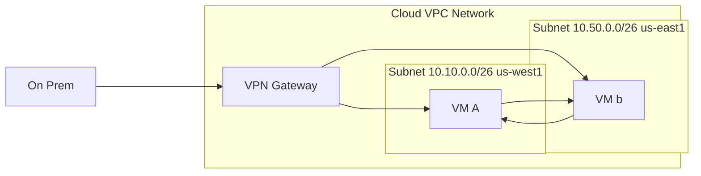

# Google VPC is global

Because VPC is global, you can use a single VPN to connect your
on-prem to the VPC network. Even though the two VMs are in discrete
regions, they are on the same VPC network so they can communciate
with internal IPs.