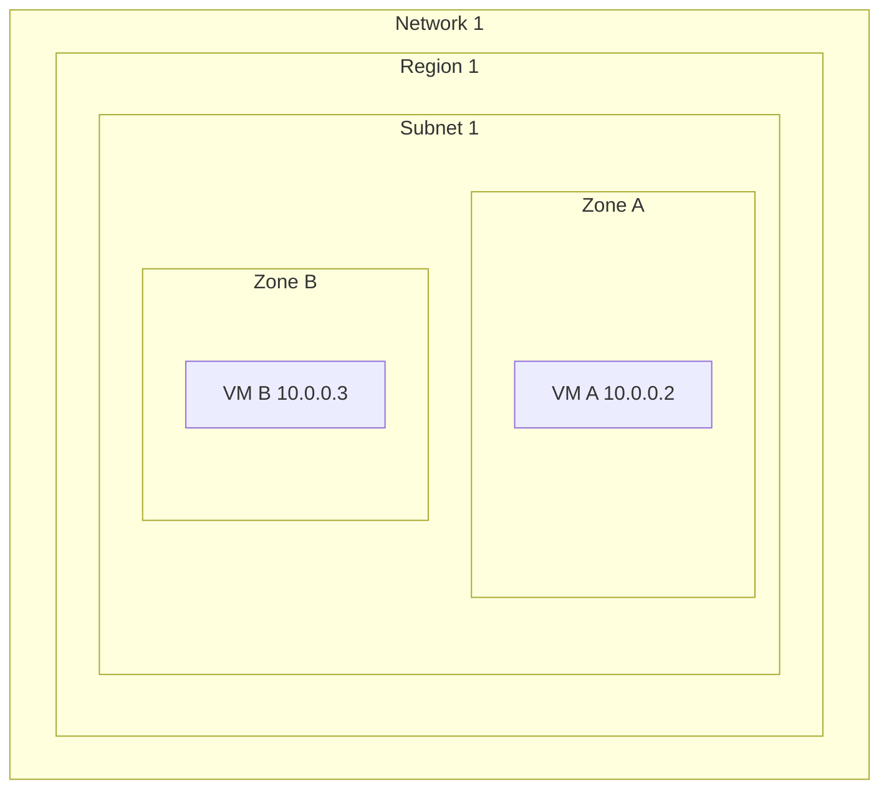

# Subnetworks cross zones

Subnets are per region, but because zones fit within a region; subnets can cross zones within that region.

* VMs can be on the same subnet but in different zones.
* Single firewall rule can apply to both VMs

### Reserved IPs

Note that the graph above has the VMs starting at address `.2` and the next is `.3`, reference [reserved ip ranges](https://cloud.google.com/vpc/docs/vpc#reserved_ip_addresses_in_every_subnet)

|    Reserved IP | Purpose         |
| -------------: | --------------- |
|        x.x.x.0 | Network Gateway |
|        x.x.x.1 | Subnet Gateway  |
| second to last | broadcast       |
|           last | broadcast       |