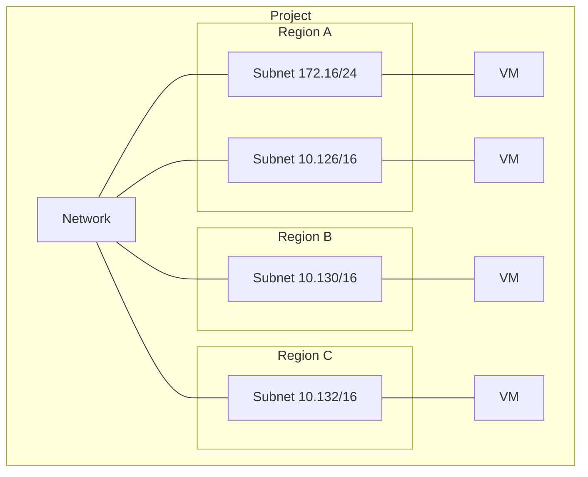

# Expand subnets without re-creating instances

You can expand the network ranges without having to shutdown any of your instances.

The things to keep in mind while doing this:
* New subnet masks cannot overlap other subnets in any region within the same VPC
* Each IP range must be a unique and valid CIDR
* The new ranges have to fall within valid _internal_ ranges, you cannot encompase a public IP within your CIDR.
* You can't make your subnet range narrower or broader than a [restricted range](https://cloud.google.com/vpc/docs/vpc#restricted-ranges)
* You can expand, but you can't shrink; which makes this a permanent unidirectional change.
* Auto mode can be expanded from `/20` to `/16`
  * If you need a larger IP range, you can convert the auto mode subnetwork to a custom mode network for full control

> Avoid large subnets! The larger the subnet the more likely
> you will collide with other IPs when you start adding more
> network interfaces and VPC peering or when you configure a
> VPN to an on-prem network.

